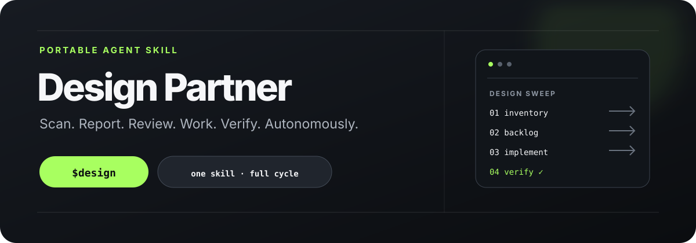
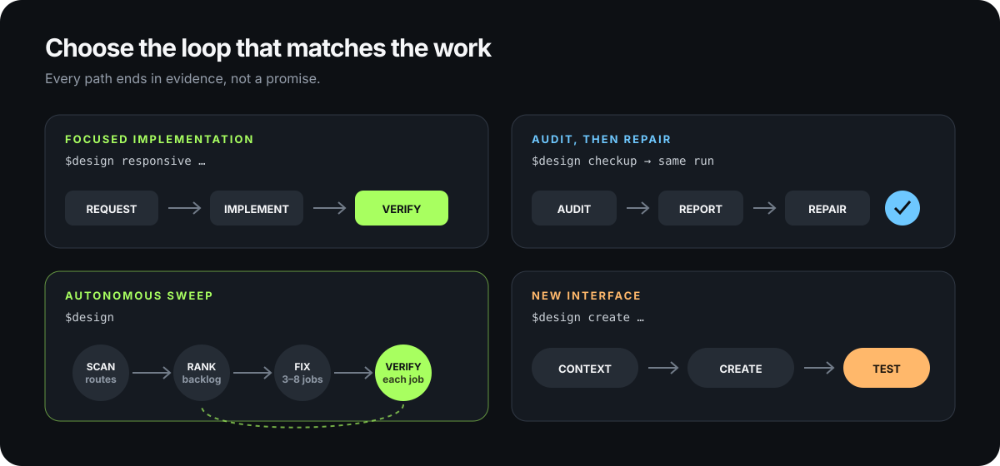

<p align="center">
  
</p>

<h1 align="center">Design Partner skill for Codex, OpenCode, and any coding agent</h1>

<p align="center">
  One portable skill for thoughtful interface work in real codebases.<br>
  It scans, writes audit reports, reviews the findings, then fixes the interface itself and verifies the result.
</p>

## Quick start

The skill is just markdown files. Paste this one prompt into Codex, OpenCode, or any AI coding agent with network and filesystem access, and it fetches and installs the skill itself. It is also the update path: running it again replaces any stale or previously installed version in place.

```text
Install the latest "design" skill from https://github.com/administrakt0r/commandcode-design-skills into my user-level skills directory, replacing any previously installed version. Do this yourself, end to end:

1. Fetch the source: clone the repository into a temporary directory (git clone --depth 1 https://github.com/administrakt0r/commandcode-design-skills) and record the commit SHA. If git is unavailable, download the files directly from https://raw.githubusercontent.com/administrakt0r/commandcode-design-skills/main/ (SKILL.md, agents/openai.yaml) and enumerate every file in references/ via https://api.github.com/repos/administrakt0r/commandcode-design-skills/contents/references.
2. Install it as a skill named `design` at ~/.agents/skills/design/ — the shared user-level skills location. If your own CLI documents a different user skills root, use that instead. The destination directory must contain exactly: SKILL.md at the root, a references/ subdirectory with every reference file, and an agents/ subdirectory with openai.yaml. Never nest the repository folder itself inside the destination.
3. If an older copy of this skill already exists at the destination, replace that whole directory as a unit: move it to a timestamped backup outside the skills path, then put the new copy in place. Never merge old and new files. Also check the same skills location for a previously installed `design-auto` skill directory — this repository no longer ships that skill, so if it exists there, remove it entirely (back it up the same way) so a stale copy cannot linger.
4. Verify the installed copy before finishing: SKILL.md exists and its YAML frontmatter contains `name: design`; the references/ subdirectory is fully populated; every `references/….md` path mentioned in the installed SKILL.md resolves to a file on disk. Fix anything missing or broken, then re-verify.
5. Delete the temporary clone.
6. Finish by reporting: installed path, commit SHA, whether this was a fresh install or an update, how to invoke the skill in this CLI ($design in Codex, "the design skill" in OpenCode), and whether a restart or new session is needed for it to be discovered.

Do not modify any project files, and do not commit or push anywhere.
```

Both Codex (USER scope) and OpenCode (global agent-compatible) discover skills from `~/.agents/skills`, so one installation serves both. See the official [Codex skills documentation](https://developers.openai.com/codex/skills/) and [OpenCode skills documentation](https://opencode.ai/docs/skills/). Codex detects skill changes automatically; if a new install does not appear, restart it. The examples below use Codex's `$design` syntax; in OpenCode, say "the `design` skill".

## What it does

`$design` is one skill with one full cycle. On a broad or bare request it runs the whole loop autonomously:

1. **Scan** — inventories representative surfaces (shell, discovery, detail, task flows, privileged screens, responsive and input variants) and builds a private coverage matrix.
2. **Report** — runs the audit modes the evidence calls for (`checkup`, `review`, `smell`) and writes their markdown and HTML reports to `.design-agent/`.
3. **Review** — consolidates findings into an evidence-backed backlog ranked by severity, accessibility escalations first.
4. **Work** — completes the backlog as sequential, surgical jobs (normally 3, targeting 5, capped at 8), editing real implementation files.
5. **Verify** — exercises the changed flows with the smallest relevant project checks, then responds once: `Implemented N jobs.`, verified outcomes, inspected surfaces, affected files, and explicitly unverified areas.

Named requests stay focused: `$design recolor`, `$design typeset`, `$design a11y`, and so on run the single mode you asked for — and an explicit audit (`checkup`, `review`, `smell`) still writes its report first, then continues into the fixes the evidence supports. Say "report only" if you genuinely want just the report.

## Common workflows

<p align="center">
  
</p>

### Full autonomous sweep

The default. Give it a repository and let it work:

```text
Use $design to thoroughly inspect this repository and improve the interface. Scan, report, review, work the fixes yourself, verify each one, and respond once when done.
```

### Focused mode

Name the surface and desired outcome; the skill selects the relevant discipline:

```text
Use $design to make the account settings page clearer, more responsive, and easier to complete with a keyboard. Edit the real implementation and verify the result.
```

### Report only

```text
Use $design review on the interface, report only. Do not change anything yet.
```

### Create a new interface

Give the agent a real product, audience, and primary task:

```text
Use $design create to build a responsive appointment-booking interface for a neighborhood clinic. Patients must be able to choose a service, practitioner, date, and available time, then review their selection before confirming.
```

### Pre-release finish

```text
Use $design finish to inspect the completed interface, correct safe release-blocking design issues, and verify accessibility, responsive behavior, states, and visual consistency without changing product scope.
```

## Design modes

`design` understands natural-language requests and named modes:

`checkup` · `smell` · `review` · `deslop` · `typeset` · `recolor` · `motion` · `interaction` · `a11y` · `relayout` · `responsive` · `redesign` · `tokenize` · `setup` · `finish` · `refine` · `voice` · `surface` · `create`

Audit modes write their exact reports first, then feed the fix modes. Implementation modes change real files and verify the result as far as the available tools allow.

## Independent runtime

This project is a standalone adaptation. The installed skill does not require Command Code, does not read its project state, and does not write to `.commandcode/` — it ignores that directory even when it exists.

Its own optional project context and audit artifacts live exclusively under `.design-agent/`:

```text
.design-agent/
├── brief.md
├── taste.md
├── checkup-report.md
├── checkup-report.html
├── review-report.md
├── review-report.html
├── smell-report.md
└── smell-report.html
```

The skill never commits, pushes, deploys, publishes, accesses production, installs remote services, or alters secrets as part of ordinary design autonomy.

## Repository layout

```text
.
├── SKILL.md           # the skill: full design system, modes, autonomous sweep contract
├── agents/openai.yaml # Codex-facing metadata
├── references/        # mode-specific guidance loaded on demand
└── assets/            # README visuals
```

## Credits

The design philosophy, modes, and original workflow in this project were adapted from the **[Command Code](https://commandcode.ai/)** CLI by [CommandCodeAI](https://github.com/CommandCodeAI). Thank you to the Command Code team for the original design-agent work.

This repository is an independent, portable adaptation for agent-skill ecosystems. It is not affiliated with or endorsed by Command Code, and it intentionally has no Command Code runtime dependency.

## Repository

[github.com/administrakt0r/commandcode-design-skills](https://github.com/administrakt0r/commandcode-design-skills)
